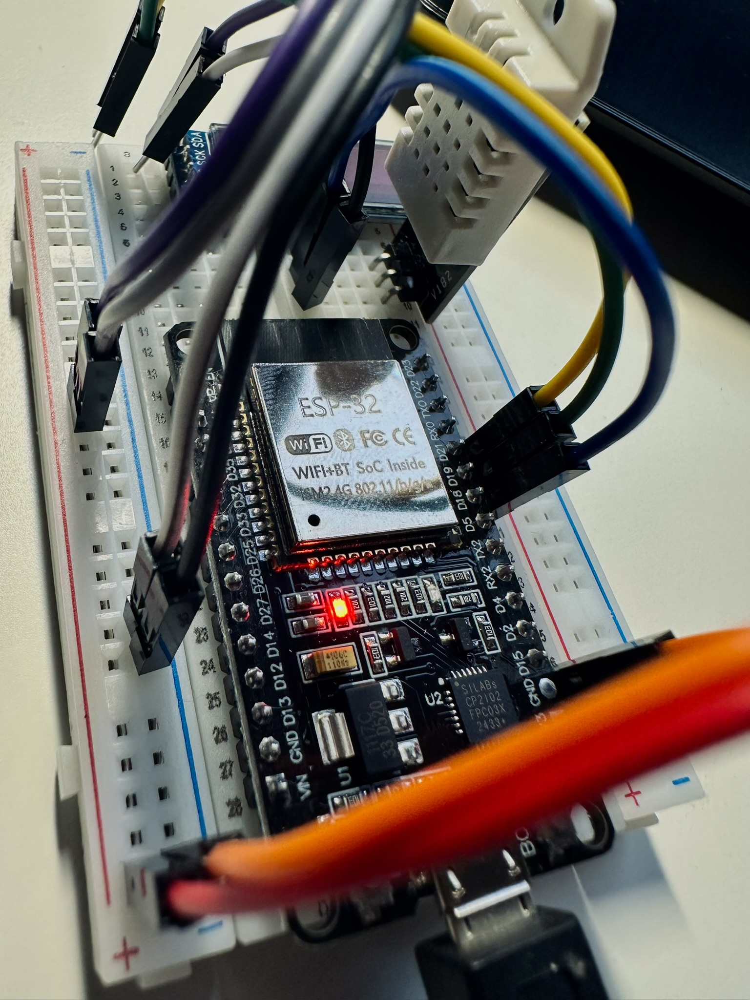

 # SmartHome — Proyecto personal IoT

 Este repositorio contiene un proyecto educativo de hogar inteligente basado en un ESP32 con un sensor de temperatura y humedad. El objetivo es trabajar los conceptos básicos de IoT: cómo un dispositivo físico envía datos de temperatura y humedad a un backend, y cómo esos datos se visualizan en una interfaz web.

 

 ## Resumen

 - **Dispositivo:** ESP32 con sensor DHT22 montado en una protoboard.
 - **Conectividad:** Wi‑Fi y comunicación mediante MQTT.
 - **Backend:** Servicio en Python que recibe y almacena los datos.
 - **Frontend:** Interfaz web para visualizar lecturas en tiempo real y gráficos básicos.

 ## Qué demuestra el proyecto

 - Flujo completo desde el sensor hasta la visualización en la web.
 - Uso de MQTT para transmisión eficiente de telemetría.
 - Cómo integrar una pequeña canalización de datos con componentes sencillos y reproducibles.

 ## Qué contiene este repositorio

 - Código de firmware para el ESP32 (carpeta `firmware/`).
 - Backend en Python con ejemplos de recepción y almacenamiento (carpeta `backend/`).
 - Frontend con una interfaz para mostrar gráficos (carpeta `frontend/`).
 - Documentación y notas del proyecto (carpeta `docs/`).

 ## Futuro y ampliaciones

 El proyecto está pensado para crecer: añadir más sensores inalámbricos, integrar una capa de gestión de dispositivos, usar protocolos RF (Zigbee/Z‑Wave), o añadir análisis predictivo con MLOps.
